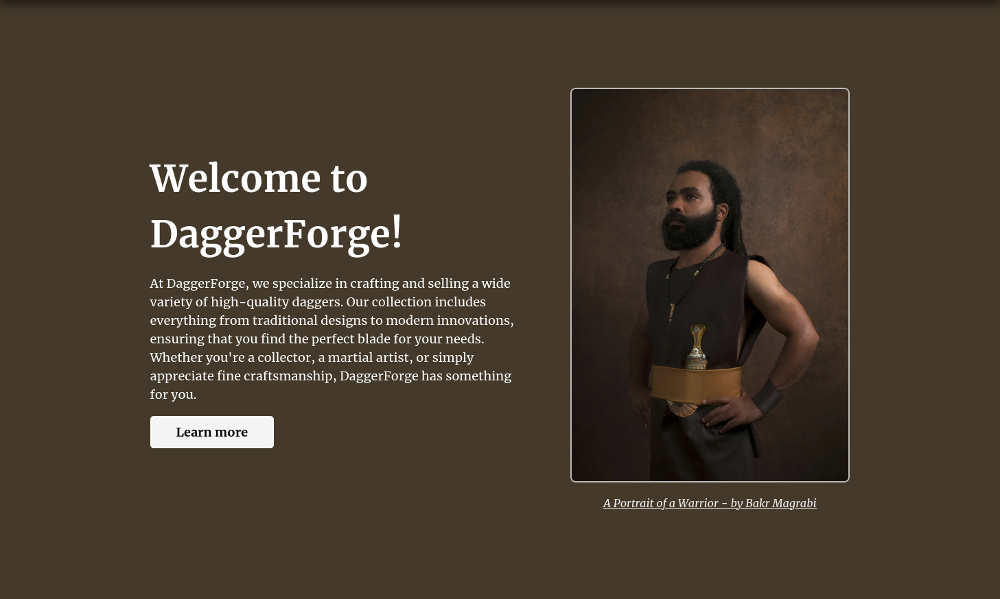
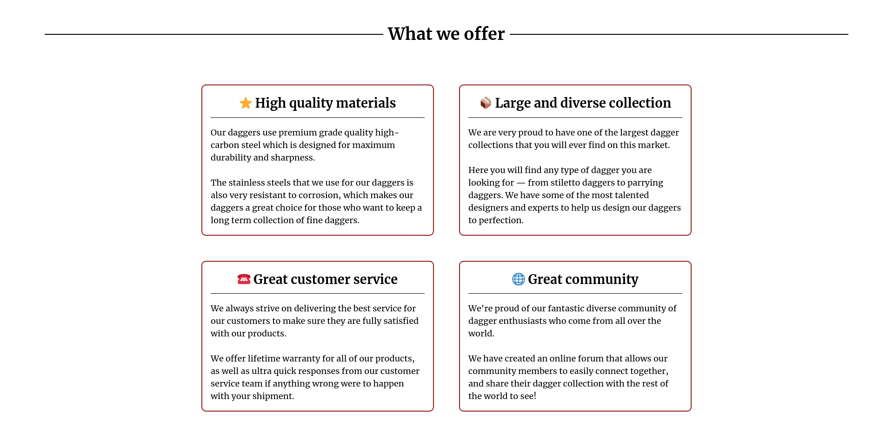

# Landing Page Project

This repository includes the code solution for the [landing page project](https://www.theodinproject.com/lessons/foundations-landing-page#setting-up-your-projects-github-repository) from The Odin Project (OTP). For this project, I have created a landing page for a fictional company that manufactures and sells daggers (known as DaggerForge).

## Contents

The page includes the following 6 sections:

+ **Header** - This includes the navbar which has the logo on the left side and other links (<u>***Note: the links have yet to be implemented***</u>)
+ **Hero section** - The purpose of this section is to introduce the users to the website and summarize its content to them.
+ **Information section** - This gives users more information about the brand and why they should choose it over any other brand.
+ **Quote section** - This section quotes a customer regarding their experience with this brand.
+ **Action section** - This section encourages users to take action by providing them links to check out products and sign up for the website. (<u>***Note: The links in this section have also not been yet implemented***</u>)
+ **Footer section** - This may contain any additional links, but for now it just includes a copyright statement.

The page mainly highlights the use of CSS, particularly how flexbox can be used to make it easier to create complex layouts. Moreover, the website is made responsive to any screen size

## Project Preview

Simply click [here](https://example.com) to view the page.

Here are also some screenshots of some parts of the page.

    
    
<em><u>Hero Section Preview</em></u>

 
 

    
    
<em><u>Information Section preview</em></u>

## Credits

All stock images used were obtained from [Pexels](https://www.pexels.com/). The DaggerForge logo, however, was AI generated and created by [Microsoft Designer](https://designer.microsoft.com/) and edited by myself.

Finally, I would like to thank TOP for giving me the project idea and giving me the opportunity to learn.

The credit for the stock images:

+ *A Portrait of a Warrior* - by Bakr Magrabi ([source](https://www.pexels.com/photo/a-portrait-of-a-warrior-5352909/))
+ *A Hand Made Knife* - by Araz Yurtseven ([source](https://www.pexels.com/photo/a-hand-made-knife-17487579/))